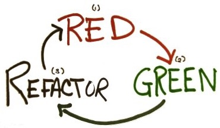

### First time in doing a Kata?

**No worries, I got your back, in 5 minutes you are ready**

When you are going to attend a Kata is good to prepare in advance your IDE or prefered environment for writing and running tests.

In the next lines we are going to:
* Install an IDE (in case you don't have any)
* Download example startup kata project
* Load the code in the IDE
* Run the example tests
* Learn a bit about TDD

**Language**

Make sure you have your prefered language interpreter or virtual machine installed. For this examples I'm covering Java/Kotlin and Python3, open a terminal and make sure you can run:

* Java/Kotlin: `java -version`
** You need the JDK, not the JRE
* Python3: `python3 --version`, or `python --version`

**Free IDEs**

* **Java** - Eclipse IDE for Java Developers or Eclipse IDE for Enterprise Java Developers: https://www.eclipse.org/downloads/packages/
* **Java/Kotlin** - IntelliJ Community: https://www.jetbrains.com/idea/download/
* **Python** - PyCharm Community: https://www.jetbrains.com/pycharm/download/

**Simple Examples**

Clone or download this very repo, it contains empty projects with basic runable test examples.

* Using Git: git clone https://github.com/franferri/your-codingdojos-katas.git
* Direct zip download: [Zip file](../../archive/master.zip)

**Open the code in your IDE**

If you are using an IDE, **dont' load the base folder of the repo**, but instead the inner project folders, like the following examples.

* **Eclipse** use File->Import->Existent Maven Project, then select the folder "example-kata-using-java" for example
* **IntelliJ**, just open the folder: "example-kata-using-java" or "example-kata-using-java-and-kotlin"
* **PyCharm**, just open the folder: "example-kata-using-python3"
** Open settings, Project interpreter, Add new, Mark Inherid global site-packages, and save
** Edit run configurations, Working Dir, remove the ending "/tests" save and Run.

### Run the example tests

The **Java** and **Kotlin** example projects use maven, maven is just handling configurations and dependencies for us, don't worrie about it for now. Maven binary is build in in the examples, you don't need to install anything.

You can run the tests with the following commands

    $ cd thisrepofolder
    $ ./mvnw clean test

The **Python** example project uses Python 3, the instructions to run the tests from the console are in the README.md file in the project folder: [Click here to open](example-kata-using-python3)

### The most important part of a Kata is to Enjoy!

Time to explore the tests folder in the sample project. Get familiar with the folders structure.

### What is a test?

A test is a mini program that will run parts of your main program. As simple as that.

Tests give you certainty about the main program behaviour, so you can be sure that it behaves as expected.

Using tests developer teams can fix issues before deploying code to production.

### Writing your first test

Sandro Mancuso has described a convention that I found really simple to understand and may help you to start: [**Naming Test Classes and Methods**](https://codurance.com/2014/12/13/naming-test-classes-and-methods/)

### What is a TDD?

TDD stands for **Test Driven Development** and it means writing the tests before you develop your main code.

Some Katas will require you to use TDD by design, others will not. As a rule of thumb is good to do TDD always unless stated diferently due the nature of the Kata.

### Use TDD
* You must write a failing test before you write any production code.
* You must not write more of a test than is sufficient to fail, or fail to compile.
* You must not write more production code than is sufficient to make the currently failing test pass.
* You should follow the circle: **Red** - **Green** - **Refactoring**:
  * Red - Create a failing test
  * Green - Write enough code to make the test pass
  * Refactor - Rearrange, clean up, rethink... your code and your tests (don't forget that your tests are code too)

Need more? Robert C. Martin (Uncle Bob) has your back: [The Cycles of TDD](http://blog.cleancoder.com/uncle-bob/2014/12/17/TheCyclesOfTDD.html)
